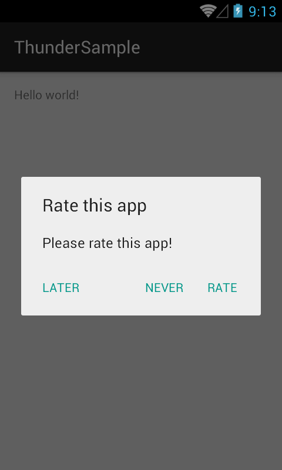

*Thunder* is a flexible library for Android that helps you to build apps painlessly and quickly. It contains the following modules out of the box:
- app
- crypto
- device
- iap
- network
- prefs
- rating

app
--------------
This module is designed to gives you the chance of getting all the related data of your app through a simple class (AppManager)

crypto
--------------
It contains the most famous hashing algorithms, such as MD2, MD5, SHA-1, SHA-256, SHA-384, SHA-512

device
--------------
This module provides important data about your physical device, e.g. screen resolution or OS version

iap (In-App Purchases)
--------------
If you need to include In-App Purchases (http://developer.android.com/google/play/billing/billing_overview.html) into your app, this module is what you need! A single entry point to manage both In-app items & subscriptions

network
--------------
A layer that makes which helps a lot for network related operations (for example checking internet connection or whether a hostname is reachable)

prefs
--------------
This module allows you to have a single entry point that handle all common operations on SharedPreferences (http://developer.android.com/reference/android/content/SharedPreferences.html) - e.g. store a string or increment an integer value and then commit

rating
--------------
It provides a really simple way (only one line of code) for implementing a rating popup. You can also build your custom rating popup through the res/values/thunder_config.xml file.
This is an example of the popup:

Important details
========

Sample project
---------------
In order to show how to integrate *Thunder* into your app, a sample project - *Thunder Sample* - has been published here https://github.com/michele-paparella/ThunderSample.

Compatibility
---------------
*Thunder* is compatible from Android API 13 (Android 3.2) and above

Permissions
---------------
In order to use *Thunder*, please be aware that the library uses the following permissions:

- android.permission.READ_PHONE_STATE
- android.permission.ACCESS_NETWORK_STATE
- android.permission.INTERNET
- com.android.vending.BILLING

License
==============
	Copyright 2015 Michele Paparella

	Licensed under the Apache License, Version 2.0 (the "License");
	you may not use this file except in compliance with the License.
	You may obtain a copy of the License at

	   http://www.apache.org/licenses/LICENSE-2.0

	Unless required by applicable law or agreed to in writing, software
	distributed under the License is distributed on an "AS IS" BASIS,
	WITHOUT WARRANTIES OR CONDITIONS OF ANY KIND, either express or implied.
	See the License for the specific language governing permissions and
	limitations under the License.
